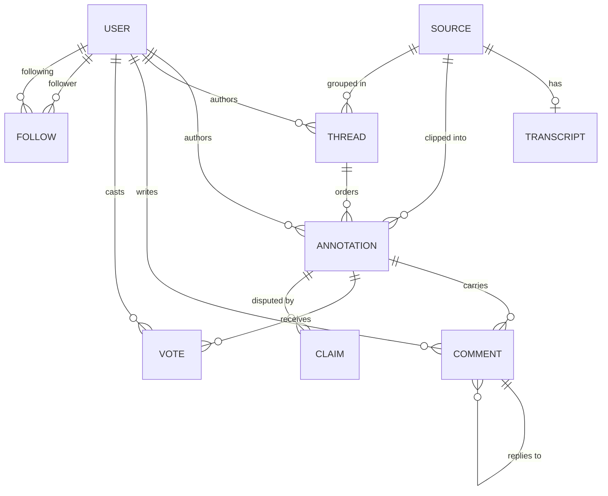
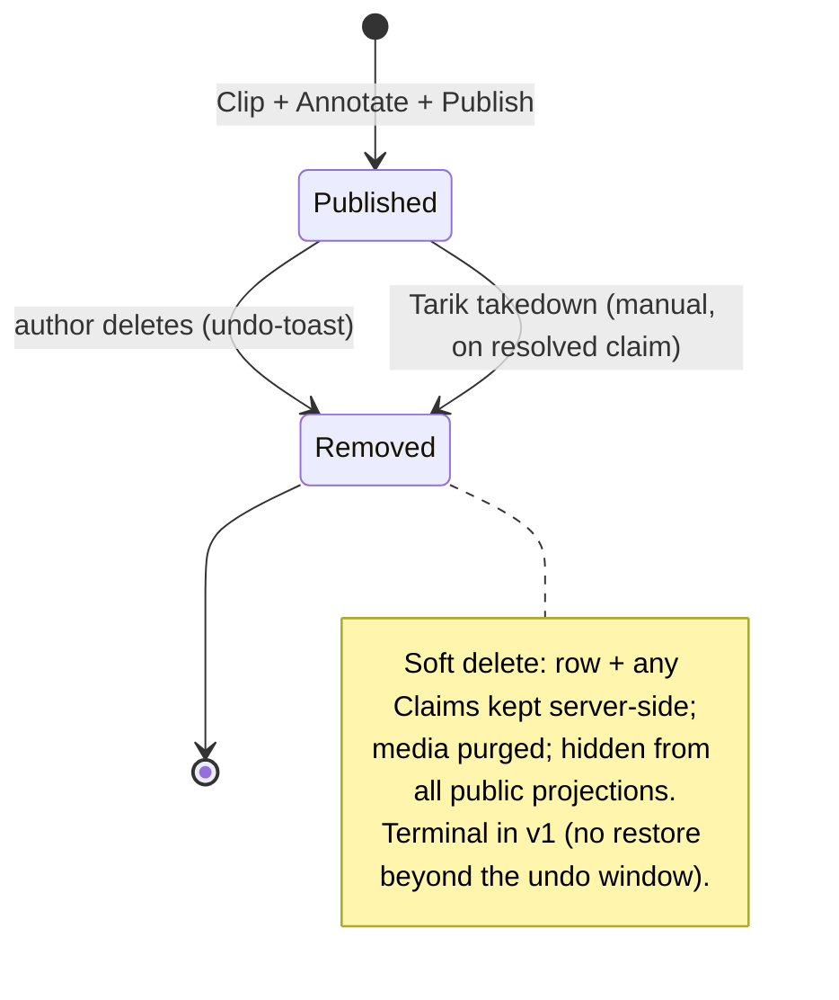
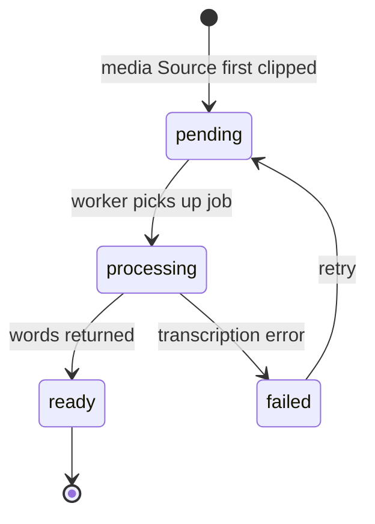
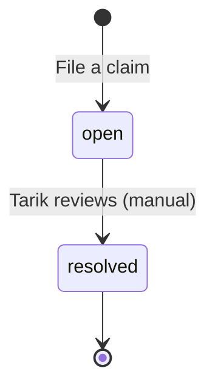

# Annotated — Conceptual Model

> **What this is.** The objects this product recognises, how they relate, what states
> they can be in, and the one committed word for each concept. This is a *design
> decision*, not a database schema — but it was reverse-engineered from the live
> `packages/backend/convex/schema.ts`, so the gap between this model and the code is
> called out explicitly. Each gap is both UX debt (users meet a product that
> contradicts the model) and tech debt (the system is harder to evolve).
>
> **Method:** walking the existing product (it's built and deployed). **Scope:** audit
> the committed model for drift.
>
> **Status:** v1 draft, 2026-05-29. Vocabulary keystones locked with Tarik; open
> questions at the bottom still need decisions.

---

## Ubiquitous language — the locked decisions

The product had a naming identity crisis across its surfaces. These are now settled.
**One word per concept, one concept per word.**

| Concept | Canonical term | Rejected / drifted | Why |
|---|---|---|---|
| The published unit (clip + author's voice) | **Annotation** | "take", "clip", "card" | Matches the domain (*Annotated*), the schema, and the URL `/a/[id]`. The fused clip-and-commentary is **one object**; the commentary is an attribute, not a separate object (non-goals kill the features that would justify splitting). |
| The author's voice on their own clip | **Take** | "commentary" | "Commentary" was a near-homonym of "Comment". "Take" was freed when "Annotation" won the noun slot, and "your take" is exactly what it is. Salvages the shipped UI word. |
| A reader's response under an annotation | **Comment** | — | Distinct object from the author's **Take**. Now collision-free. |
| The engagement mechanic | **Vote** — **Brilliant** (↑) / **BS** (↓) | "like" | Bidirectional in the live schema (`value: +1/-1`, `downCount`). The code noun `likes`/`likeCount` contradicts the shipped mechanic — logged as debt. |
| Selecting the span from a source | **Clip** (verb) | — | Names the real operation: choosing a 90s time span or a text range. |
| Adding your Take to the clip | **Annotate** (verb) | "take" (as verb) | Second of the two creation verbs, matching the bounty's "clip *and* annotate". |

---

## Objects

Nine objects. Caches (`rssCache`, `itunesCache`) are infrastructure, not user-meaningful
— excluded by design.

### User
**What it is:** a person on Annotated, mirrored from their Clerk identity on first sign-in.
**Attributes:** username, displayName, avatarUrl, bio, xHandle.
**Relationships:**
- authors zero-or-many **Annotation**s
- authors zero-or-many **Comment**s, **Thread**s
- casts zero-or-many **Vote**s
- participates in **Follow** in two roles — **as follower** and **as following** (see discipline note)
**Actions:** Clip → Annotate, Comment, Reply, Vote (Brilliant/BS), Follow, Unfollow, edit profile.

### Source
**What it is:** the original media a clip points *into* — a YouTube video, a podcast
episode, or an article. **Shared across all users**: two people clipping the same
episode share one Source row.
**Attributes:** type (`youtube` | `podcast` | `article`), canonicalUrl, title, author
*(the media's creator — an external person, **not** a User; correctly an attribute)*,
plus type-specific fields (youtube\*, podcast\*/mp3Url, siteName/imageUrl).
**Relationships:**
- has zero-or-one **Transcript** (media sources only)
- is clipped into zero-or-many **Annotation**s
- is grouped in zero-or-many **Thread**s
**Actions:** none directly — a Source is a *referent*. Users act on Annotations, which
point at Sources. The product "points at the source, it doesn't replace it."

### Transcript
**What it is:** the word-level, timestamped text of a media Source — computed once,
reused forever, shared per Source.
**Attributes:** provider (`deepgram` | `youtube-vtt`), wordsJson (each word: text,
startMs, endMs, speaker, confidence), status.
**Relationships:** belongs to one **Source**.
**Actions:** Transcribe (system action, not user-facing). Drives the podcast
transcript-anchored clipping — the product's whole differentiation.

### Annotation
**What it is:** **the central object** — a clip of a Source plus the author's **Take**,
published to a source-linked landing page and the feed.
**Two shapes**, determined by the Source type (one object, named shapes — see open Q3):
- **Time-clip** (youtube / podcast Source): `clipStartMs`/`clipEndMs`, `clipStorageId`
  (the sliced media file); podcast clips also carry `selectedText` (the transcript quote)
- **Text-highlight** (article Source): `textStart`/`textEnd`/`selectedText`, **no media
  element**, `screenshotStorageId` as the citation visual
**Attributes:** the **Take** — `commentaryText` and/or `commentaryAudioStorageId`
(+ best-effort `commentaryAudioTranscript`); `isAnonymous` (masks author in every public
projection; `authorId` retained server-side for claims/moderation); `isPublic`,
`publishedAt`; denormalized `commentCount`, `likeCount`/`downCount` (→ vote counts).
**Relationships:**
- authored by one **User** (`authorId`)
- clipped from one **Source** (`sourceId`)
- optionally ordered within one **Thread** (`threadId` + `threadOrder`)
- carries zero-or-many **Comment**s
- receives zero-or-many **Vote**s
- disputed by zero-or-many **Claim**s
**Actions:** Publish, Vote (Brilliant/BS), Comment, File a claim, Publish anonymously,
**Remove** (author soft-delete via undo-toast; Tarik takedown). No author "unpublish" —
Remove is terminal.

### Thread
**What it is:** an ordered series of Annotations from **one Source by one author**,
addressable at `/t/[id]` (Jason's #1 demo flow).
**Attributes:** title (optional), createdAt.
**Relationships:** authored by one **User**; drawn from one **Source**; orders
zero-or-many **Annotation**s.
**Actions:** create, order, title.

### Comment
**What it is:** a reader's response under an Annotation. **Distinct from the author's
Take.**
**Attributes:** text, createdAt.
**Relationships:** belongs to one **Annotation**; written by one **User**; optionally
**replies to** one parent **Comment** (nesting capped at one level — a reply to a reply
flattens to the same top-level parent).
**Actions:** Comment, Reply.

### Follow
**What it is:** a directed follow relationship between two Users. (An associative object,
but real to the user — "your followers", "following".)
**Attributes:** none beyond its two endpoints.
**Relationships:** connects one **User as follower** → one **User as following**.
Self-follow is rejected.
**Actions:** Follow, Unfollow.

### Vote
**What it is:** one User's judgment on one Annotation — **Brilliant** (↑) or **BS** (↓).
Stored in the `likes` table (legacy name).
**Attributes:** value (`+1` Brilliant | `-1` BS). One vote per (user, annotation);
re-voting toggles/changes direction.
**Relationships:** cast by one **User**; on one **Annotation**.
**Actions:** Vote Brilliant, Vote BS, change/remove vote.

### Claim
**What it is:** a fair-use dispute against an Annotation. Written to the DB and emailed
to Tarik; manual review only (v1).
**Attributes:** **claimantName**, **claimantEmail** *(the disputing party is **not**
modelled as a User — they aren't necessarily signed in; deliberate boundary)*, reason,
submittedAt, status.
**Relationships:** disputes one **Annotation**.
**Actions:** File a claim (public, unauthenticated), Resolve (manual, Tarik only).

---

## Discipline notes

- **Follow roles named explicitly.** Follow connects User→User; the endpoints play
  different roles — **follower** and **following**. Modelling them as bare "User" would
  lose the asymmetry.
- **`Source.author` is an attribute, not a relationship.** It names an external creator
  (a podcast host, an article byline), not a User in the system. Correctly a string.
- **`Claim.claimant*` is an attribute, not a relationship.** The disputing party is
  external and unauthenticated. Deliberately not a User reference.
- **The Take is an attribute of Annotation, not its own object.** Confirmed against the
  non-goals (no multi-clip threads, no cross-source annotations) — nothing justifies
  promoting it to an object in v1.
- **No speculative additions.** Every object traces to a shipped need. The two caches are
  excluded as infrastructure.

---

## Object map

> Cardinality: `||` exactly one, `o|` zero-or-one, `o{` zero-or-many; crow's foot on the
> "many" side; labels read first-entity → second-entity.
> **Not shown** (external, not in-model): `CLAIM`'s claimant and `SOURCE`'s author are
> string attributes, not entities.

---

## State transitions

### Annotation

**No Draft state** — an Annotation is *born* Published (megaphone, not personal library;
see Resolved Q1). `isPublic` is the public-visibility flag: `true` = Published,
`false` = Removed. The two doors into **Removed** are one mechanism — voluntary delete and
involuntary takedown both soft-delete. A filed **Claim** does **not** auto-change state in
v1 (manual review only), and an open Claim does **not** block the author from removing —
soft-delete already preserves the dispute record, so the claimant's standing survives the
clip going dark (see Resolved Q2/Q7).

### Transcript

### Claim

---

## Action vocabulary (verbs)

| Verb | Applies to | Notes |
|---|---|---|
| **Clip** | Source → Annotation | Select the span (time or text). |
| **Annotate** | Annotation | Add your **Take** (text and/or recorded audio). |
| **Publish** | Annotation | Draft → Published. Variant: **Publish anonymously**. |
| **Comment** | Annotation | Reader adds a top-level Comment. |
| **Reply** | Comment | One level deep; deeper replies flatten. |
| **Vote** | Annotation | **Brilliant** (↑) / **BS** (↓); toggle to change/remove. |
| **Follow / Unfollow** | User → User | Self-follow rejected. |
| **File a claim** | Annotation | Public, unauthenticated. |
| **Remove** | Annotation | Author soft-delete (instant + undo-toast, no modal) or Tarik takedown. Terminal; record kept server-side. |
| **Transcribe** | Source | System action; not user-facing. |

**Flattening checks passed:** "Clip" and "Annotate" kept separate (two real operations,
not one). "Vote" exposes its two directions by name rather than hiding them under a
generic verb. **Open:** "Publish" may hide an unpublish/edit operation (Q1); "Delete" is
unmodelled (Q2).

---

## Open questions (need decisions)

1. ✅ **RESOLVED — No Draft state.** An Annotation is born Published (megaphone, not
   personal library — Jason persona's anti-Pocket litmus). `isPublic` is repurposed as the
   public-visibility flag: `true` = Published, `false` = Removed. No author "unpublish".
2. ✅ **RESOLVED — Soft delete, terminal.** Author can **Remove** their own Annotation via
   instant action + ~5s undo-toast (no confirmation modal — persona friction-killer). Soft
   delete: row + Comments + Votes + Claims kept server-side, media storage purged, hidden
   from all public projections. Shared Source is never touched. Removed is terminal (no
   restore beyond the undo window).
3. **Time-clip vs Text-highlight.** Kept as one Annotation object with a Source-type
   discriminator. Is the divergence (media + span vs no-media + text range) big enough to
   warrant two named objects, or does one object with two documented shapes stay correct?
   (Recommendation: one object — splitting would be speculative.)
4. **Naming debt — Vote.** Migrate `likes` table / `likeCount` → `votes` / `voteScore`,
   honoring the backward-compat constraint (existing value-less rows read as Brilliant).
5. **Naming debt — Take.** Schema fields stay `commentary*`. Rename to `take*`, or keep
   the field names and only align the UI/product language to "Take"?
6. **Thread title default.** `title` is optional — what displays when absent? ("Thread on
   {Source.title}"?)
7. ✅ **RESOLVED — No auto-takedown in v1.** A Claim never auto-changes Annotation state
   (manual review only, per non-goals). Tarik *can* manually transition a clip to Removed
   on a resolved-against claim (same soft-delete door as author Remove). An open Claim does
   **not** block author Remove — soft-delete preserves the dispute record, so the claimant's
   standing survives the clip going dark.
8. **Anonymous projection audit.** `isAnonymous` must mask the author in *every* public
   projection — feed, landing, profile, **and thread**. Confirm `authorId` is never
   leaked in any of the four.
