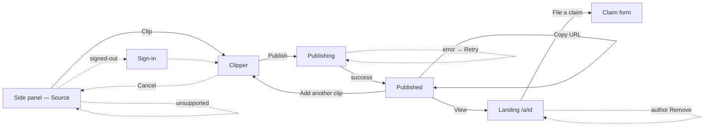

# Annotated — Interaction Flow: Clip → Annotate → Publish

> **What this is.** The interaction logic for the core hot path — how a signed-in user
> moves from "I see something BS-or-brilliant" to "I have a citable URL with my take on
> it." Sits above `docs/conceptual-model.md` (what exists) and below the surface (how it
> looks). Notation is breadboarding (Shape Up): places, affordances → destinations, and
> the content each place needs. No layout.
>
> **Method:** breadboarding. **Grounded in:** the locked conceptual model + the Jason
> persona's JTBD (`docs/jason-persona.md`). **Status:** v1 draft, 2026-05-29.
>
> **Vocabulary is the model's ubiquitous language** — Clip, Annotate, **Take**, Publish,
> **Vote** (Brilliant/BS), Comment, **Remove**. Never "commentary", never "like".

---

## Job story

*When I'm on a page with a clip worth amplifying or pushing back on, I want to grab a
90-second slice, bake in my take, and publish to a shareable URL — fast enough to paste
into X before I lose the thought.*

- **Start:** signed-in, side panel open, on a YouTube / podcast / article page.
- **Success:** a live `/a/[id]` URL on the clipboard, take attached, source one click away.
- **Bar:** 60–90s end-to-end (persona). Every place below is pressure-tested against it.

---

## The places (5 + an auth gate)

The spine is short on purpose — the persona abandons past 5–6 steps.

1. **Side panel — Source** — what the panel shows when it wakes on a page
2. **Clipper** — clip-select **and** take composer **and** publish, one place (shape varies)
3. **Publishing** — the async slice/upload/create state
4. **Published** — success; the URL is the payload
5. **Landing `/a/[id]`** — the published artifact (web app), where others engage
6. *(gate)* **Sign-in** — one-click X / Google, only if session is missing

---

## Breadboard

### 1. Side panel — Source
```
Side panel — Source
- [auto on open] detect source on active tab → resolves to one of the states below
- Clip → Clipper                         (only when a clippable Source is detected)
[ Source title + author/show + type badge ("🎙 Podcast: {episode} — {show}") ]
[ fair-use frame visible: "clip up to 90s (fair use)" ]

States of this place:
- Loading:      [ "Detecting source…" ] — no affordances yet
- Detected:     [ source card + Clip affordance ] — the happy path
- Transcribing: [ "Transcribing this episode…" + seconds indicator ] (podcast, transcript
                not ready) — Clip disabled until ready
- Unsupported:  [ "This episode can't be clipped" (Spotify-exclusive / no RSS / no media) ]
                — graceful dead-end, no Clip affordance, link out to source
- Signed-out:   any Clip attempt → Sign-in gate
```

### 2. Clipper  *(clip-select + Take composer + publish — one place)*
```
Clipper
- Set span (affordance varies by Source shape, below) → updates clip preview in place
- Write Take (text)                       → enables Publish when span + take valid
- Record Take (audio) → one-take recorder → enables Publish; shows take counter + waveform
- Toggle "Publish anonymously" (default OFF)
- Publish → Publishing
- Back / Cancel → Side panel — Source     (discards in-progress clip; no persisted draft)
[ clip preview (player scrub / transcript quote / highlighted text) ]
[ Take input: text field + one-click Record upgrade ]
[ live fair-use guard: span capped at 90s; text capped ~100 words — stop at limit, no error ]

Span affordance by Source shape:
- YouTube (time-clip):  "Use current playback position" for in/out + draggable handles.
                        NEVER a type-the-digits picker (persona friction-killer).
- Podcast (time-clip):  DRAG ACROSS TRANSCRIPT WORDS → 90s audio span auto-derived.
                        (The differentiation. Auto-fills the quote as selectedText.)
- Article (text-highlight): drag across cleaned article text → text range; no media.
                        Screenshot of original captured at clip time (fair-use citation).

Conditions / guards:
- Publish disabled until: span valid AND at least one of {Take text, Take audio} present
  (mandatory commentary — a fair-use value, not just validation).
- No confirmation modal anywhere (persona friction-killer).
```

### 3. Publishing  *(async)*
```
Publishing
- [auto] worker slices clip → uploads to storage → creates Annotation (born Published)
- Cancel → Clipper                         (abort before the row is created, if possible)
[ progress with SECONDS-REMAINING indicator (persona: no bare spinners) ]
[ stage labels: "Slicing 0:90…" → "Uploading…" → "Publishing…" ]

Failure paths (each is a required step, not an afterthought):
- Slice/transcode error → [ "Couldn't slice that clip" + Retry → Publishing | Back → Clipper ]
- Upload/network timeout → [ Retry → Publishing | Back → Clipper ]
- Orphaned-blob risk: if create fails after upload, the blob is cleaned up (known debt d/i).
```

### 4. Published  *(success — the URL is the payload)*
```
Published
- Copy URL → clipboard                     (auto-copied on arrival; toast "URL copied")
- View → Landing /a/[id]                   (new tab)
- Add another clip from this Source → Clipper (carries threadId; 30s follow-on target)
- Done → Side panel — Source
[ the /a/[id] URL, prominent ]
[ tiny preview: take + source title ]

Megaphone reflex: URL auto-copies so the next action is Cmd-Tab → paste into X.
```

### 5. Landing `/a/[id]`  *(web app — where the artifact lives and others engage)*
```
Landing /a/[id]
- Vote Brilliant (↑) / Vote BS (↓)         → updates count in place (signed-out → Sign-in)
- Add Comment / Reply                      → thread updates in place (signed-out → Sign-in)
- Open source link → original (new tab)    (the "receipt"; always present)
- File a claim → claim form                (PROMINENT, not a footer — fair-use value)
- Remove (AUTHOR ONLY) → soft-delete       → undo-toast ("Removed — Undo", ~5s), then gone
[ clip player (audio/video) OR quote (podcast) OR highlighted text (article) ]
[ the Take (text and/or audio note + transcript caption) ]
[ author byline + avatar — OR "Anonymous" if isAnonymous ]
[ source screenshot (article) / og:image — the citation visual ]
[ Vote counts, Comment thread ]

States:
- Removed:  [ graceful 404 / "This annotation was removed" ] — a URL already pasted to X
            never leaks content. (Depends on the locked soft-delete state.)
- Anonymous: author identity masked in every projection; authorId never sent to client.
```

### 6. Sign-in  *(gate)*
```
Sign-in
- Continue with X → back to the affordance that triggered the gate
- Continue with Google → back to the triggering affordance
[ X + Google only — no email/password (persona: one-click or it's friction) ]
```

---

## Flow diagram



> Solid = happy path; dotted = gate / failure / edge. The text breadboard is canonical —
> the diagram drops content and conditional detail.

---

## Measurement — worker slice latency (2026-05-29)

*Local M-series Mac + home network, warm; replicating the exact `youtube-clipper.ts` /
`audio-clipper.ts` commands.*

| Path | Step | Time |
|---|---|---|
| YouTube | yt-dlp section download **with** `--force-keyframes-at-cuts` (current) | 19–27s |
| YouTube | ffmpeg 240p H.264 re-encode | ~5s |
| YouTube | **total (current worker)** | **~24–32s** |
| YouTube | yt-dlp **without** `--force-keyframes-at-cuts` | **3.7s** |
| Podcast | curl redirect resolve | 0.75s |
| Podcast | ffmpeg `-c copy` range-seek (no re-encode) | 0.73s |
| Podcast | **total** | **~1.5s** |

**Not yet measured (add to the production estimate):** Convex storage upload (~1–2s for a
5 MB mp4), Fly **scale-to-zero cold-start** (fly.toml: boot + tsx ≈ several seconds, first
clip only), and Fly `shared-cpu-1x` being ~2–3× slower than local for the re-encode.

**Findings:**
1. **Asymmetry:** podcast/article are trivially fast (~1.5s); YouTube is the only slow
   path (~30s).
2. **The bottleneck is one removable flag.** `--force-keyframes-at-cuts` is ~85% of the
   YouTube slice time. It forces a re-encode *inside* yt-dlp purely for a frame-exact start
   — but the worker's ffmpeg step **already re-encodes** for the 240p downscale, so the
   exact-start trim can move there for free: download a slightly padded section without the
   flag (~4s), then ffmpeg `-ss <pad> -t 90` trims to the exact start in the pass it was
   doing anyway. Estimated YouTube slice → **~9–15s** (Fly-adjusted). Logged as worker debt.

## Open decisions (gaps to resolve)

1. ✅ **RESOLVED — Optimistic landing (b), + mandatory worker fix.** The data settles it:
   podcast/article wait-in-panel fine (~1.5s), but YouTube at ~24–32s (current) — or even
   ~9–15s fixed — is too long for a panel stare, and the megaphone reflex wants the URL
   *now*. So: **create the Annotation row immediately (a `processing` media sub-state),
   navigate to a Landing that shows "clip processing…", and swap in the player when the
   worker finishes** — the shareable URL exists in ~2s regardless of slice time.
   **Independently mandatory:** drop `--force-keyframes-at-cuts` and move exact-start trim
   to the ffmpeg pass (3× win, shrinks the processing window, near-free). This adds a
   `processing` value to the Annotation media state — feed/landing must render it gracefully.
2. **Auto-copy URL on publish** vs an explicit Copy button. Persona's megaphone reflex
   leans auto-copy + toast. Confirm.
3. **Podcast transcript-not-ready.** Block Clip until `ready` (current), or let the user
   pre-select intent and queue? Sync transcription (~20–40s, debt j) directly threatens the
   <90s counter-argument target — this is where that flow can blow its budget.
4. **Thread creation — implicit vs explicit.** Does the first "Add another clip from this
   Source" silently create the Thread, or is there an explicit "Start a thread"? Implicit is
   faster (persona); explicit is clearer. (Threading = persona's #1 high-leverage flow.)
5. **Anonymous toggle memory.** Per-clip default-off (current model), or remembered for the
   session once set?

---

## Risks (dependencies on layers below / unsettled state)

- **Worker slice latency** — measured (above). YouTube is the only path at risk (~30s
  current). Mitigated by the `--force-keyframes-at-cuts` fix (→ ~9–15s) **and** optimistic
  landing (decision #1), which decouples the URL from the slice entirely.
- **Podcast transcription latency** (sync, debt j; Deepgram async-callback can't reach
  localhost, see memory) can break JTBD #2's <90s target. May need a "transcribing"
  place that doesn't feel like a dead wait.
- **Removed-state Landing** (404/tombstone) depends on the soft-delete state locked in the
  conceptual model this session — it must be implemented for shared URLs not to leak.
- **No broken/isolated objects detected:** Annotation's attributes + actions (clip, take,
  source, votes, comments, claim, remove) all co-locate on the Landing; the Source
  relationship is navigable via the source link; the Thread relationship is navigable via
  "Add another clip" + the `/t/[id]` page.
